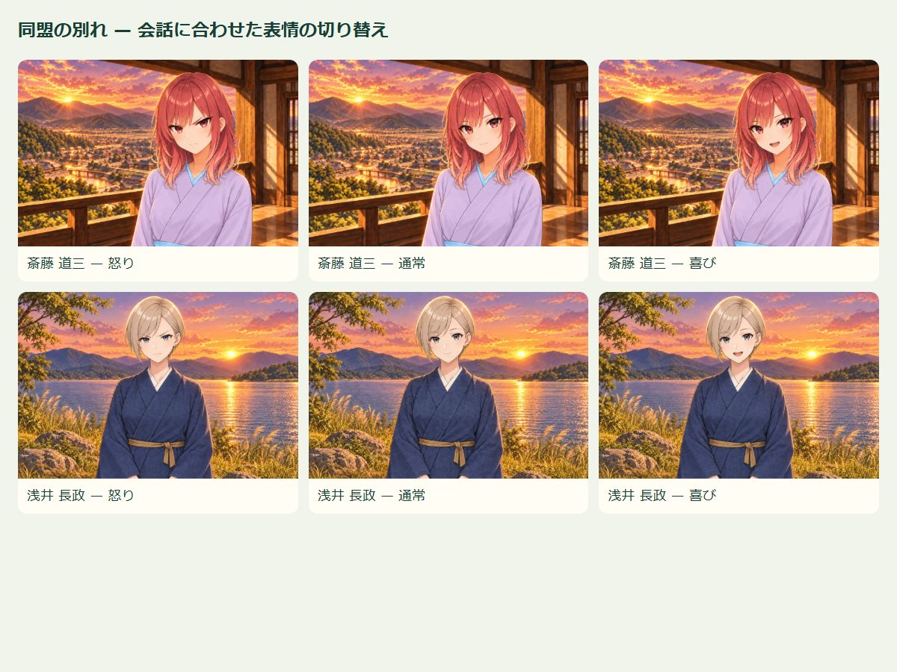
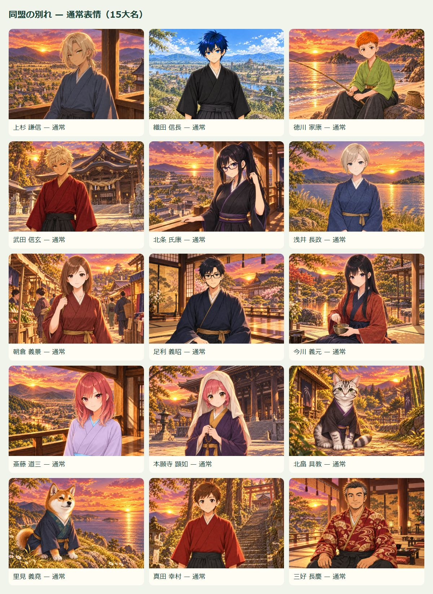

# 同盟の別れ 確認用

RN版のローカルWeb実行、iPhone 15 Pro相当393×852。合成した検証用状態から実際の同盟破棄操作とOK操作を録画。音声なし。iOS実機録画ではありません。

- [齋藤の動画（iPhone縦・余白修正版）](saito-iphone.mp4) — 怒り→「なんてね」で通常→思い出を語るところで喜び
- [徳川の動画](tokugawa.mp4) — 通常→「二人で過ごした時間は」で喜び

## 追加画像

- [uesugi-normal-v1.webp](uesugi-normal-v1.webp)
- [oda-normal-v1.webp](oda-normal-v1.webp)
- [tokugawa-normal-v1.webp](tokugawa-normal-v1.webp)
- [takeda-normal-v1.webp](takeda-normal-v1.webp)
- [hojo-normal-v1.webp](hojo-normal-v1.webp)
- [azai-normal-v1.webp](azai-normal-v1.webp)
- [asakura-normal-v1.webp](asakura-normal-v1.webp)
- [ashikaga-normal-v1.webp](ashikaga-normal-v1.webp)
- [imagawa-normal-v1.webp](imagawa-normal-v1.webp)
- [saito-normal-v1.webp](saito-normal-v1.webp)
- [honganji-normal-v1.webp](honganji-normal-v1.webp)
- [kitabatake-normal-v1.webp](kitabatake-normal-v1.webp)
- [satomi-normal-v1.webp](satomi-normal-v1.webp)
- [sanada-normal-v1.webp](sanada-normal-v1.webp)
- [miyoshi-normal-v1.webp](miyoshi-normal-v1.webp)
- [saito-angry-v1.webp](saito-angry-v1.webp)
- [azai-angry-v1.webp](azai-angry-v1.webp)
- [oda-happy-v1.webp](oda-happy-v1.webp)

本番コードや検証データは含めていません。
